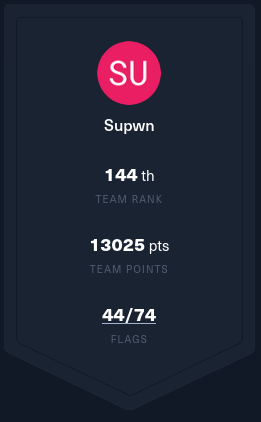

# CTF-HTB-Apocalypse-2023-Write-ups
Write-ups of the challenges I was able to complete with my team Supwn

We succesfully completed 44 challenges out of the 74 of the CTF with only 3 members in our team :smile:

## Warmup
- [x] Welcome!

## Web
- [x] Trapped Source
- [x] Gunhead
- [x] Drobots
- [x] Passman
- [x] Orbital
- [x] Didactic Octo Paddles
- [ ] SpyBug
- [ ] UnEarthly Shop
- [ ] TrapTrack

## Pwn
- [x] Initialise Connection
- [x] Questionnaire
- [x] Getting Started
- [x] Labyrinth
- [ ] Pandora's Box
- [ ] Void
- [ ] Kana
- [ ] Control Room
- [ ] Math Door
- [ ] Runic

## Crypto
- [x] Ancient Encodings
- [x] Small StEps
- [x] Perfect Synchronization
- [ ] Multipage Recyclings
- [ ] Inside The Matrix
- [ ] Colliding Heritage
- [ ] Elliptic Labyrinth
- [ ] Elliptic Labyrinth Revenge 
- [ ] Biased Heritage
- [ ] Converging Visions
- [ ] Blokechain

## Reversing
- [x] Shattered Tablet
- [x] She Shells C Shells
- [x] Needle in a Haystack
- [x] Hunting License
- [x] Cave System
- [x] Alien Saboteur
- [x] Somewhat Linear
- [ ] Gimmick DSP
- [ ] Vessel Cartographer
- [ ] Analogue Signal Processing

## Forensics
- [x] Plaintext Tleasure
- [x] Aliean Cradle
- [x] Extraterrestrial Persistence
- [x] Roten
- [x] Packet Cyclone
- [x] Relic Maps
- [ ] Artifacts of Danger
- [ ] Bashic Ransomware
- [ ] Interstellar C2
- [ ] Pandora's Bane

## Misc
- [x] Persistence
- [x] Hijack
- [x] Restricted
- [x] Remote computation
- [x] Janken
- [x] nehebkaus trap
- [x] The Chasm's Crossing Conundrum
- [x] Calibrator

## Blockchain
- [x] Navigating the unknown
- [x] Shooting 101
- [x] The Art of Deception

## Hardware
- [x] Timed Transmission
- [x] Critical Flight
- [ ] Debug
- [ ] Secret Code
- [ ] HM74

## ML
- [x] Reconfiguration
- [x] Mysterious Learnings
- [x] Last Hope
- [x] On The Rescue
- [ ] Vision Chip
- [ ] Reading the Stars
- [ ] The Trial of the Sky
