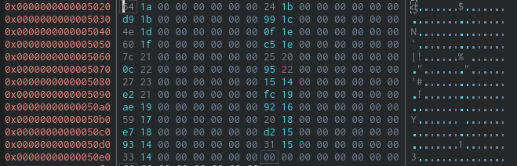

# Alien Saboteur

## Context

You finally manage to make it into the main computer of the vessel, it's time to get this over with. You try to shutdown the vessel, however a couple of access codes unknown to you are needed. You try to figure them out, but the computer start speaking some weird language, it seems like gibberish...

## A first look at the challenge

When opening the challenge zip file we obtain two files :

```
./rev_alien_saboteur
├── bin
└── vm
```

One of them is the executable and the other one, like the context says, is "gibberish" :

```
file vm 
vm: ELF 64-bit LSB pie executable, x86-64, version 1 (SYSV), dynamically linked, interpreter /lib64/ld-linux-x86-64.so.2, BuildID[sha1]=10fb238b19d3a82b46536b51e47396525086a09c, for GNU/Linux 3.2.0, not stripped

file bin
bin: data
```

Since the name of the executable file is `vm`, we can already guess that the `vm` somehow interpreting the `bin` file. But to confirm that we will have to take a look at what's inside this `vm` executable.

## Reversing the vm

Thankfully for us the binary is not stripped which means the functions have really nice and obvious names. The most interesting thing we see is a lot of `vm_*` functions :


Opening up the graph view on the main function of the binary we can see what could be guessed when trying to execute the binary :

```
./vm
Usage: ./chall file
```

This `vm` binary expects a file to decode. Looking at the main function of `vm` we can see that the first thing the binary does is opening and copying in its address space the content of the file given as parameter.


Then the main function calls `vm_create` and then `vm_run`.
We obviously want to give the `bin` file to this vm and we can see that indeed that it now expects a keycode :

```
./vm bin
[Main Vessel Terminal]
< Enter keycode 
> AAAAAAAAAAAAAAAAAAAAAAAAAAAAAA
Unknown keycode!
```

Taking a look at the `vm_create` function we can see several call to `calloc`, `memset` and `memcpy`. Basicly this function creates a memory space for the execution of the `bin` file it is loading.

Finally the `vm_run` function basicly runs a loop calling a `vm_step` function and that's where the magic happens.


## Reversing `vm_step` to understand how the VM works


This function is taking 6 bytes of the entry file an then interprets it. And the first byte is the opcode. In the Decompiler we can see this portion which shows that very clearly :

```
movzx eax, byte [var_1h]
cdqe
lea rdx, [rax*8]
lea rax, original_ops
mov rdx, qword [rdx + rax]
mov rax, qword [var_18h]
mov rdi, rax
call rdx
nop
leave
ret
```

At first I saw the `call rdx` that looked sus. And indead when looking just above you see that to interpret the file the `vm` takes a byte and adds it to the value (kindly) named `original_ops` by the decompiler and then calls the resulting value. So rdx is basicly `original_ops + opcode*8`. And taking a look at the location that `original_ops` we can see why that is :



At the `original_ops` every 8 byte there is an address, and at this point we might expect it already, each of these address points to one of the `vm_*` function.

Now we roll up our sleeves and we are going to have to build our own decompiler for this `bin` because if we want to find the keycode to enter the vessel terminal we are going to have to find what that binary actually does once it is interpreted.

## Decompiling the alien gibberrish

Obviously i made this little decompiler in python. Here is how it was done.

First we take the first three bytes out when loading the file (don't ask me why the alien put a UwU at the beginning of the file) :
```
#!/usr/bin/python

bin_file = open('./rev_alien_saboteur/bin',"rb")
bin_file_bytes = bin_file.read()
bin_file_bytes = bin_file_bytes[3:] # UwU-less bin file :)
```

Then, you can probably automate it, but I listed all the `vm_*` function and their offset by hand (was a bit long but I had nothing better to do) :

```
#manual implementation of the dict 
OpCodeDict = {}
OpCodeDict[0x00]="vm_add"
OpCodeDict[0x01]="vm_addi"
OpCodeDict[0x02]="vm_sub"
OpCodeDict[0x03]="vm_subi"
OpCodeDict[0x04]="vm_mul"
OpCodeDict[0x05]="vm_muli"
OpCodeDict[0x06]="vm_div"
OpCodeDict[0x07]="vm_cmp"
OpCodeDict[0x08]="vm_jmp"
OpCodeDict[0x09]="vm_inv"
OpCodeDict[0x0a]="vm_push"
OpCodeDict[0x0b]="vm_pop"
OpCodeDict[0x0c]="vm_mov"
OpCodeDict[0x0d]="vm_nop"
OpCodeDict[0x0e]="vm_exit"
OpCodeDict[0x0f]="vm_print"
OpCodeDict[0x10]="vm_putc"
OpCodeDict[0x11]="vm_je"
OpCodeDict[0x12]="vm_jne"
OpCodeDict[0x13]="vm_jle"
OpCodeDict[0x14]="vm_jge"
OpCodeDict[0x15]="vm_xor"
OpCodeDict[0x16]="vm_store"
OpCodeDict[0x17]="vm_load"
OpCodeDict[0x18]="vm_input"
```

Once this is done we can start analysing the `bin` file :

```
for i in range(len(bin_file_bytes)//6) :
    instruction_line = bin_file_bytes[6*i:6*i+6]

    #don't print blank lines :/
    if instruction_line == b'\x00\x00\x00\x00\x00\x00' and bin_file_bytes[6*(i+1):6*(i+1)+6] == b'\x00\x00\x00\x00\x00\x00' :
        continue
    else :
        print (f"{i} | ",end='')
    
    # print(instruction_line[0])
    if instruction_line[0] in OpCodeDict.keys() :
        print(OpCodeDict[instruction_line[0]],end='')
        print(" -> ",instruction_line[1:])
```

Soon we realise that a lot of lines don't work or are blank that's why we always test if the opcode is in the dictionnary or if the line is blank.

With that first version, we already see that it seems to work :
```
0 | vm_putc ->  b'[\x00\x00\x00\x00'
...
40 | vm_putc ->  b'>\x00\x00\x00\x00'
41 | vm_putc ->  b' \x00\x00\x00\x00'
42 | vm_mov ->  b'\x1e\xa0\x0f\x00\x00'
43 | vm_mov ->  b'\x1c\x00\x00\x00\x00'
44 | vm_mov ->  b'\x1d\x11\x00\x00\x00'
45 | vm_input ->  b'\x19\x00\x00\x00\x00'
46 | vm_store ->  b'\x1e\x19\x00\x00\x00'
47 | vm_addi ->  b'\x1e\x1e\x01\x00\x00'
48 | vm_addi ->  b'\x1c\x1c\x01\x00\x00'
49 | vm_jle ->  b'\x1c\x1d-\x00\x00'
50 | vm_mov ->  b'\x1e\x04\x10\x00\x00'
```

We can see the first thing the binary does is execute a lot of `vm_putc` which print the greeting message one character by one character. And then we can see all the functions `vm_*` have similar arguments we always see them followed by a `0x1c` , `0x1d` or `0x1e` etc ...

That is the last thing to understand about the `vm` mechanics, these bytes corresponds to offsets in the memory of the `vm` executable. Every `vm_*` function uses these parameters as offset from the same base address in the `vm` memory. You can understand that by analysing the working of two different functions like `vm_add` and `vm_mov` in debugging mode. 

These memory spaces act as registers. That's how the `vm` executable makes it all work. Every 6 bytes of the `bin` file is taken as a command line. The first byte is taken as an opcode which allows the `vm` executable to choose which `vm_*` function it is going to call. Then the chosen `vm_*` function modifies the register in the `vm` memory, or print a character, or take a character as input. And using these registers and functions the `vm` executable indeed works like a very minimalist virtual machine that interprets the `bin` file.

## How to crack this binary though

Well at that point my solution becomes a bit stupid because I could have worked a lot harder on the decompiler to make it do the work. But I did a lot of things by hand. The reason for that is most of the things that I just explained, I only figured them out, little by little, when trying to understand the structure of the `bin` file.

### First how the `vm_*` functions work ?

It took me a while to figure out how each of this function works but in case you want to dive a bit into the decompiled code of the `bin` file here are a few insights

#### vm_putc `char`
- Prints to stdout the `char`

#### vm_input `reg`
- Takes a char from stdin and puts it into `reg`

#### vm_mov `reg` `value`
- Put `value` into the chosen `reg`

#### vm_add `register_result` `reg_1` `reg_2`
- Store the result of `reg_1`+`reg_2` in `reg_result`

#### vm_addi `register_result` `reg_1` `immediate_value`
- Store the result of `reg_1`+`immediate_value` in `reg_result`

#### vm_xor `register_result` `reg_1` `reg_2`
- Store the result of `reg_1`^`reg_2` in `reg_result`

#### vm_load `reg_1` `reg_2`
- Load the value at the address contained in `reg_2` inside `reg_1`

#### vm_store `reg_1` `reg_2`
- Store the content of `reg_2` at the address in `reg_1`

#### vm_jle `reg_1` `reg_2` `address`
- If `reg_1` < `reg_2` jump at `address` (note that the address in the `bin` files are just line numbers)

### The keycode :

The first part of the `bin` file expects a keycode here is how the code works :
```
0 | vm_putc ->  b'[Main Vessel Terminal]
                < Enter keycode 
                > '

42 | vm_mov ->  b'\x1e\xa0\x0f\x00\x00'        -> # reg_1e <- 0fa0
43 | vm_mov ->  b'\x1c\x00\x00\x00\x00'       |   # reg_1c <- 0000
44 | vm_mov ->  b'\x1d\x11\x00\x00\x00'       |   # reg_1d <- 0011 (17 len de la string je crois)
45 | vm_input ->  b'\x19\x00\x00\x00\x00'     |   # vm_input = getchar() -> reg_19
46 | vm_store ->  b'\x1e\x19\x00\x00\x00'     |   # store reg_19 at [reg_1e]
47 | vm_addi ->  b'\x1e\x1e\x01\x00\x00'      |   # reg_1e <- reg_1e + 01 # reg_1e=0fa1
48 | vm_addi ->  b'\x1c\x1c\x01\x00\x00'      |   # reg_1c <- reg_1c + 01 # reg_1c=0001
49 | vm_jle ->  b'\x1c\x1d\x2d\x00\x00'       \___# if reg_1c < reg_1d jump 2d  (if i < 17)
                                                  else :           
50 | vm_mov ->  b'\x1e\x04\x10\x00\x00'     ,--> # reg_1e <- 1004
51 | vm_mov ->  b'\x1f\xa0\x0f\x00\x00'     |    # reg_1f <- 0fa0 [loc de la string input]
52 | vm_mov ->  b'\x1c\x00\x00\x00\x00'     |    # reg_1c <- 0000
53 | vm_mov ->  b'\x1d\n\x00\x00\x00'       |    # reg_1d <- 000a
54 | vm_mov ->  b'\x1b\xa9\x00\x00\x00'     |    # reg_1b <- 00a9
55 | vm_mov ->  b'\x17\x00\x00\x00\x00'     |    # reg_17 <- 0000
56 | vm_load ->  b'\x19\x1e\x00\x00\x00'    |    # reg_19 <- [reg_1e] [harcoded string -> ca 99 cd 9a f6 db 9a cd f6 9c c1 dc dd cd 99 de c7]
57 | vm_load ->  b'\x18\x1f\x00\x00\x00'    |    # reg_18 <- [reg_1f] [[loc de la string input]]
58 | vm_xor ->  b'\x19\x19\x1b\x00\x00'     |    # reg_19 <- reg_19 ^ reg_1b(0xa9)
59 | vm_je ->  b'\x19\x18\x4e\x00\x00'      |     # if reg_19 == reg_18 then jump 4e \
                                            |    else :                              |
60 | vm_putc ->  b'Unknown keycode!'        |    # print unknow keycode              |
77 | vm_exit ->  b'\x00\x00\x00\x00\x00'    |                                        |
                                            |                                     <__/
78 | vm_addi ->  b'\x1e\x1e\x01\x00\x00'    |    # reg_1e += 1
79 | vm_addi ->  b'\x1f\x1f\x01\x00\x00'    |    # reg_1f += 1
80 | vm_addi ->  b'\x1c\x1c\x01\x00\x00'    |    # reg_1c += 1
81 | vm_jle ->  b'\x1c\x1d8\x00\x00'         \__ # if reg_1c < reg_1d jump 38
```

Once we understand a bit what the `vm_*` functions do we can see pretty easily that the keycode is the hardcoded string located at 0x1004 in the `bin` file XORed by the `reg_1b` that contains the `0xa9` byte as we can see at line 54.

Indeed in the `bin` file we can see with a hexdump that there are some data after all the code :
```
$ hexdump -C ./bin 
...
*
00001000  00 00 00 00 00 00 00 ca  99 cd 9a f6 db 9a cd f6  |................|
00001010  9c c1 dc dd cd 99 de c7  00 00 00 00 00 00 00 00  |................|
00001020  00 00 00 00 00 00 00 00  00 00 00 00 00 00 00 00  |................|
*
00001190  00 00 00 00 00 00 00 13  19 0f 0a 07 00 1d 0e 16  |................|
000011a0  10 0c 01 0b 1f 18 14 08  09 1c 1a 21 04 22 12 05  |...........!."..|
000011b0  1b 11 20 06 02 15 17 0d  1e 23 03 00 00 00 00 00  |.. ......#......|
000011c0  00 00 00 00 00 00 00 00  00 00 00 00 00 00 00 00  |................|
*
000011f0  00 00 00 00 00 00 00 00  00 00 00 16 b0 47 b2 01  |.............G..|
00001200  fb de eb 82 5d 5b 5d 10  7c 6e 21 5f e7 45 2a 36  |....][].|n!_.E*6|
00001210  23 d4 d7 26 d5 a3 11 ed  e7 5e cb db 9f dd e2 00  |#..&.....^......|
00001220  00 00 00 00 00 00 00 00  00 00 00 00 00 00 00 00  |................|
*
00001250  00 00 00 00 00 00 00 00  00 00 00 00 00 00 00 65  |...............e|
00001260  5d 77 4a 33 40 56 6c 75  37 5d 35 6e 6e 66 36 6c  |]wJ3@Vlu7]5nnf6l|
00001270  36 70 65 77 6a 31 79 5d  31 70 7f 6c 6e 33 32 36  |6pewj1y]1p.ln326|
00001280  36 31 5d 00 00 00 00 00  00 00 00 00 00 00 00 00  |61].............|
00001290  00 00 00 00 00 00 00 00  00 00 00 00 00 00 00 00  |................|
*
```
And at address 1004 there is a hex string and once we XOR it with the `0xa9` byte we find a printable string.
This gives us the first code (sadly not the only one) :
`c0d3_r3d_5hutd0wn`

### XORing itself 

If the code is wrong the binary print `Terminal Blocked` and exits. But if we enter the right keycode it will deobfuscate itself to reveal the lines of code that posed a problem earlier in our python decompiler. Indeed the binary XORed several of it's own lines with the `0x45` byte.

```
108 | vm_mov ->  b'\x1e\x77\x00\x00\x00'         # reg_1e <- 77
109 | vm_muli ->  b'\x1e\x1e\x06\x00\x00'        # reg_1e <- reg_1e*6 
110 | vm_mov ->  b'\x1c\x00\x00\x00\x00'         # reg_1c <- 00 00
111 | vm_mov ->  b'\x1d\xdc\x05\x00\x00'         # reg_1d <- 05dc
112 | vm_mov ->  b'\x1b\x45\x00\x00\x00'         # reg_1b <- 0045 (value XORing the memory)
113 | vm_load ->  b'\x19\x1e\x00\x00\x00'     ,> # load in reg_19 the value in [reg_1e]
114 | vm_xor ->  b'\x19\x19\x1b\x00\x00'      |  # reg_19 <- reg_19 ^ reg_1b (0x45)
115 | vm_store ->  b'\x1e\x19\x00\x00\x00'    |  # reg_1e <- put in reg_1e the new value Xored
116 | vm_addi ->  b'\x1e\x1e\x01\x00\x00'     |  # reg_1e += 1
117 | vm_addi ->  b'\x1c\x1c\x01\x00\x00'     |  # reg_1c += 1
118 | vm_jle ->  b'\x1c\x1d\x71\x00\x00'      \_# if reg_1c < reg_1d [end value of the memory to XOR] jump 71
                                                 else :
119 | vm_putc ->  b'Enter Secret Phrase'        # Once unXORed the binary asks another passphrase
142 | vm_putc ->  b' \x00\x00\x00\x00'
```

To get the rest of the code I added an ugly `else` in my python decompiler :

```
else :
        instruction_line = bytes( a^b for (a,b) in zip(instruction_line,b'\x45\x45\x45\x45\x45\x45'))
        if instruction_line[0] in OpCodeDict.keys() :
            print(OpCodeDict[instruction_line[0]],end='')
            print(" -> ",instruction_line[1:])
```

Now we have access to the last lines of code

### The final but not the easiest passphrase 

Now we want to find how our second passphrase is checked, and it is not just simply XORed this time around.

```
143 | vm_mov ->  b'\x1e\x30\x11\x00\x00'            # reg_1e <- 1130
144 | vm_mov ->  b'\x1c\x00\x00\x00\x00'            # reg_1c <- 0000
145 | vm_mov ->  b'\x1d$\x00\x00\x00'               # reg_1d <- 0024 [taille de la string en 0x1130 0x24 -> 36]
146 | vm_input ->  b'\x19\x00\x00\x00\x00'          # reg_19 <- getchar()
147 | vm_store ->  b'\x1e\x19\x00\x00\x00'          # [reg_1e] <- reg_19
148 | vm_addi ->  b'\x1e\x1e\x01\x00\x00'           # reg_1e += 1   
149 | vm_addi ->  b'\x1c\x1c\x01\x00\x00'           # reg_1c += 1
150 | vm_jle ->  b'\x1c\x1d\x92\x00\x00'            # if reg_1c < reg_1d jump 92 (En gros on getchar() * 36 )
                                                else : on a donc nos 36 chars en [reg_1e]
151 | vm_mov ->  b'\x1c\x00\x00\x00\x00'            # reg_1c <- 0000
152 | vm_mov ->  b'\x1d\x23\x00\x00\x00'            # reg_1d <- 0023
153 | vm_mov ->  b'\x1e\x30\x11\x00\x00'            # reg_1e <- 1130            (là où on a enregistrer l'input passphrase)
154 | vm_mov ->  b'\x1f\x94\x11\x00\x00'            # reg_1f <- 1194            (probablement la loc de la comparaison -> liste d'offset en fait )
155 | vm_mov ->  b'\x1a\x00\x00\x00\x00'            # reg_1a <- 0000            ( compteur de 0 à 35 )
156 | vm_mov ->  b'\x1b\x23\x00\x00\x00'            # reg_1b <- 0023            (taille de la comparaison)
157 | vm_load ->  b'\x14\x1e\x00\x00\x00'        ,> # reg_14 <- [reg_1e]            (input[i] -> reg_14)
158 | vm_load ->  b'\x15\x1f\x00\x00\x00'        |   # reg_15 <- [reg_1f]
159 | vm_push ->  b'\x14\x00\x00\x00\x00'        |   # push reg_14                  ( reg_13 <- reg_14)
160 | vm_pop ->  b'\x13\x00\x00\x00\x00'         |   # pop reg_13
161 | vm_mov ->  b'\x12\x30\x11\x00\x00'         |   # reg_12 <- 1130               ( reg12 devient la loc de la string)
162 | vm_add ->  b'\x12\x12\x15\x00\x00'         |   # reg_12 <- reg_12 + reg_15    ( on offset du premier char de ce qui se trouve en 1f)
163 | vm_load ->  b'\x11\x12\x00\x00\x00'        |   # reg_11 <- [reg_12]           (puis on store dans reg_11 le reg_15 è char de l'input )
164 | vm_store ->  b'\x1e\x11\x00\x00\x00'       |   # [reg_1e] <- reg_11           ( on store le résultat en [reg_1e])
165 | vm_store ->  b'\x12\x13\x00\x00\x00'       |   # [reg_12] <- reg_13           ( )
166 | vm_addi ->  b'\x1a\x1a\x01\x00\x00'        |   # reg_1a += 1                  ( i+= 1)
167 | vm_addi ->  b'\x1e\x1e\x01\x00\x00'        |   # reg_1e += 1                  ( un elt plus loin dans l'input)
168 | vm_addi ->  b'\x1f\x1f\x01\x00\x00'        |   # reg_1f += 1                  ( un elt plus loin dans la liste d'offset)
169 | vm_jle ->  b'\x1a\x1b\x9d\x00\x00'         \__# if reg_1a < reg_1b jump 9d

170 | vm_mov ->  b'\x1e0\x11\x00\x00'              # reg_1e <- 1130                 ( contient l'input mais permuté)
171 | vm_mov ->  b'\x1f\xf8\x11\x00\x00'           # reg_1f <- 11f8                 ( la string de Xor)
172 | vm_mov ->  b'\x1a\x00\x00\x00\x00'           # reg_1a <- 0000                 ( i compteur)
173 | vm_mov ->  b'\x1b#\x00\x00\x00'              # reg_1b <- 0023                 ( longueur de la comparaison 35)
174 | vm_load ->  b'\x14\x1e\x00\x00\x00'        ,># reg_14 <- [reg_1e]             ( reg_14 prend l'input permuté )
175 | vm_push ->  b'\x1f\x00\x00\x00\x00'        |  # push reg_1f                   ( reg_0f <- reg_1f (la string de comparaison ?))
176 | vm_pop ->  b'\x0f\x00\x00\x00\x00'         |  # pop reg_0f                    
177 | vm_add ->  b'\x0f\x0f\x1c\x00\x00'         |  # reg_0f <- reg_0f + reg_1c     ( adresse de la string_to_xor + reg_1c)
178 | vm_load ->  b'\x10\x0f\x00\x00\x00'        |  # reg_10 <- [reg_0f]            ( reg_10 prend le char )
179 | vm_xor ->  b'\x14\x14\x10\x00\x00'         |  # reg_14 <- reg_14 ^reg_10        (Xor l'input par 10 )
180 | vm_store ->  b'\x1e\x14\x00\x00\x00'       |  # [reg_1e] <- reg_14            ( on store l'input xoré )
181 | vm_addi ->  b'\x1a\x1a\x01\x00\x00'        |  # reg_1a += 1                   ( on incrémente le compteur )
182 | vm_addi ->  b'\x1e\x1e\x01\x00\x00'        |  # reg_1e += 1                   ( on incrémente le charatère concerné de l'input permuté )
183 | vm_jle ->  b'\x1a\x1b\xae\x00\x00'         \_# if reg_1a < reg1b jump ae (174)
                                                   else :
184 | vm_addi ->  b'\x1c\x1c\x01\x00\x00'           # reg_1c += 1
185 | vm_jle ->  b'\x1c\x1d\x99\x00\x00'           # if reg_1c < reg_1d jump 99 ()
                                                    else :
186 | vm_mov ->  b'\x1e\x30\x11\x00\x00'           # reg_1e <- 1130
187 | vm_mov ->  b'\x1f\x5c\x12\x00\x00'           # reg_1f <- 125c
188 | vm_mov ->  b'\x1a\x00\x00\x00\x00'           # reg_1a <- 0000
189 | vm_mov ->  b'\x1b\x23\x00\x00\x00'           # reg_1b <- 0023
190 | vm_load ->  b'\x0f\x1e\x00\x00\x00'          # reg_0f <- [reg_1e] (la chaine permutée et xoré)
191 | vm_load ->  b'\x10\x1f\x00\x00\x00'          # reg_10 <- [reg_1f] (l'ultime chaine de comparaison ?)
192 | vm_je ->  b'\x0f\x10\xc9\x00\x00'            # if reg_0f == reg_10 jump c9 \
                                                                                 |
193 | vm_putc ->  b'Wrong!'                                                      |
200 | vm_exit ->  b'\x00\x00\x00\x00\x00'                                        |
                                                                               <_/
201 | vm_addi ->  b'\x1a\x1a\x01\x00\x00'
202 | vm_addi ->  b'\x1e\x1e\x01\x00\x00'
203 | vm_addi ->  b'\x1f\x1f\x01\x00\x00'
204 | vm_jle ->  b'\x1a\x1b\xbe\x00\x00'           # if reg_1a < reg_1b jump be (190)

205 | vm_putc ->  "Access granted, shutting down"
236 | vm_exit ->  b'\x00\x00\x00\x00\x00'
```
If you want to understand completely what's happening I let you read my notes here above but **simply** what's happening is the binary uses the 3 last strings stored at the end of the binary that we saw ealier :

```
$ hexdump -C ./bin 
...

00001190  00 00 00 00 00 00 00 13  19 0f 0a 07 00 1d 0e 16  |................|
000011a0  10 0c 01 0b 1f 18 14 08  09 1c 1a 21 04 22 12 05  |...........!."..|
000011b0  1b 11 20 06 02 15 17 0d  1e 23 03 00 00 00 00 00  |.. ......#......|
000011c0  00 00 00 00 00 00 00 00  00 00 00 00 00 00 00 00  |................|
*
000011f0  00 00 00 00 00 00 00 00  00 00 00 16 b0 47 b2 01  |.............G..|
00001200  fb de eb 82 5d 5b 5d 10  7c 6e 21 5f e7 45 2a 36  |....][].|n!_.E*6|
00001210  23 d4 d7 26 d5 a3 11 ed  e7 5e cb db 9f dd e2 00  |#..&.....^......|
00001220  00 00 00 00 00 00 00 00  00 00 00 00 00 00 00 00  |................|
*
00001250  00 00 00 00 00 00 00 00  00 00 00 00 00 00 00 65  |...............e|
00001260  5d 77 4a 33 40 56 6c 75  37 5d 35 6e 6e 66 36 6c  |]wJ3@Vlu7]5nnf6l|
00001270  36 70 65 77 6a 31 79 5d  31 70 7f 6c 6e 33 32 36  |6pewj1y]1p.ln326|
00001280  36 31 5d 00 00 00 00 00  00 00 00 00 00 00 00 00  |61].............|
00001290  00 00 00 00 00 00 00 00  00 00 00 00 00 00 00 00  |................|
*
```

The first string is actually a permutation, you can see that each elementss of the string is between `0x00` and `0x23`.

The second string is used for XORing, as a kind of key.

Finally the third string is the result you should obtain.

When I first looked at the above code, once unXORed, I thought this was a simple XOR with a key, then a permutation and here we go we have the passphrase. But it is not that simple.

You can see the only loop I have not represented at line 185, it is a simple `if reg_1c < reg_1d jump 0x99` (note that it's line 153 in decimal). Since the value held by `reg_1d` was `0x23` I thought it was an iteration over the string because the passphrase expected is of size 36, but actually the XORing and the permutation over the passphrase we input is already performed inside this loop.

At that point I realised that the string we entered for passphrase was actually XORed and then permuted **36 times**.

So I wrote a keygen but it did not work at first. Indeed another thing I did not notice was that the second string was not used as a key as I thought at first. Actually one single byte of this string is used to XOR every byte of the input string. But the byte used is changed at every iteration of the greater loop I just mentionned.

In the end we finally get the process our input goes through :
```
for i in range(36):
    # The input is permuted following the permutation string at 1194
    # Then the result is XORed with the i-th character of the XOR string at 11f8
```
## Final Step : Keygen.py

Now that we understood what this alien binary does we can finally calculate the final passphrase. Once we have all the elements in the right order the keygen is pretty easy to write :
```
#!/usr/bin/python

permut_byte_array = b'\x13\x19\x0f\x0a\x07\x00\x1d\x0e\x16\x10\x0c\x01\x0b\x1f\x18\x14\x08\x09\x1c\x1a\x21\x04\x22\x12\x05\x1b\x11\x20\x06\x02\x15\x17\x0d\x1e\x23\x03'
Xor_Key_byte_array = b'\x16\xb0\x47\xb2\x01\xfb\xde\xeb\x82\x5d\x5b\x5d\x10\x7c\x6e\x21\x5f\xe7\x45\x2a\x36\x23\xd4\xd7\x26\xd5\xa3\x11\xed\xe7\x5e\xcb\xdb\x9f\xdd\xe2'
Solution_Compare_String = b'\x65\x5d\x77\x4a\x33\x40\x56\x6c\x75\x37\x5d\x35\x6e\x6e\x66\x36\x6c\x36\x70\x65\x77\x6a\x31\x79\x5d\x31\x70\x7f\x6c\x6e\x33\x32\x36\x36\x31\x5d'

# I prefer the permutation as a dict
PermutDict = {}
for i in range(len(permut_byte_array)) :
    PermutDict[permut_byte_array[i]] = i

# function to XOR a byte_array with a single byte
def Xor(bytes_array_a,value) :
    return bytes(a^value for a in bytes_array_a)

# function to swap two bytes in a byte array
def swapbytes(byte_array,i,j) :
    res = b''
    for c in range(len(byte_array)) :
        if c == i :
            res += bytearray( [byte_array[j]] )
        elif c == j :
            res += bytearray( [byte_array[i]] )
        else :
            res += bytearray( [byte_array[c]] )
    return res

# use the previous function to apply the permutation to the byte array
def PermutByteArray(bytes_array) :
    byte_res = bytes_array
    for i in range(36)[::-1] :
        byte_res = swapbytes(byte_res,i,permut_byte_array[i])
    return byte_res

# Now we print the 36 iterations for good measure ._.
for i in range(36) :
    Solution_Compare_String = PermutByteArray(Xor(Solution_Compare_String,Xor_Key_byte_array[35-i]))
    print(Solution_Compare_String)
```

And it works ! :grinning:
We get the flag (and the passphrase) !

```
$ ./keygen.py
....
b'HTB{5w1rl_4r0und_7h3_4l13n_l4ngu4g3}'
```

## Conclusion

That was a very nice challenge, It took me a while because i figured out things on the fly every time something was not clicking. I think if I had took more time in reversing the `vm_*` functions I could have made a much better python decompiler for the challenge but still that's probably the hardest Cracking challenge I have done so far so I'm still happy about it. I liked the constant progression that you get through the challenge even though it takes a long time to do everything, the progress is very linear, you never really get hardstuck which was very enjoyable.

I am sorry for the ugly decompiled code and the manual comments but I hope the write-up is still understandable without every aspect of the *alien gibberish*.

Xlitoni for the Supwn team